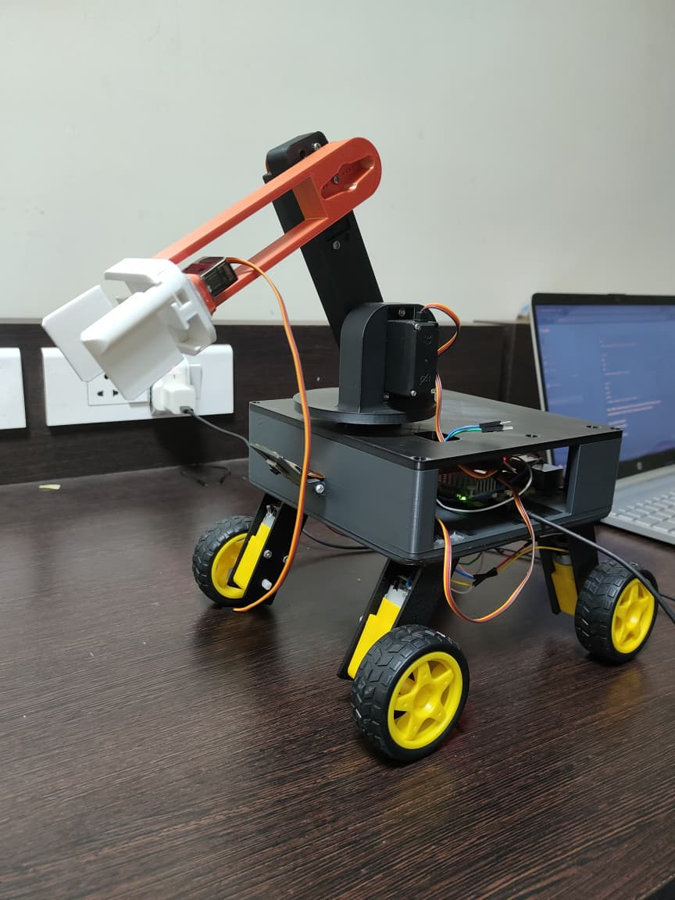
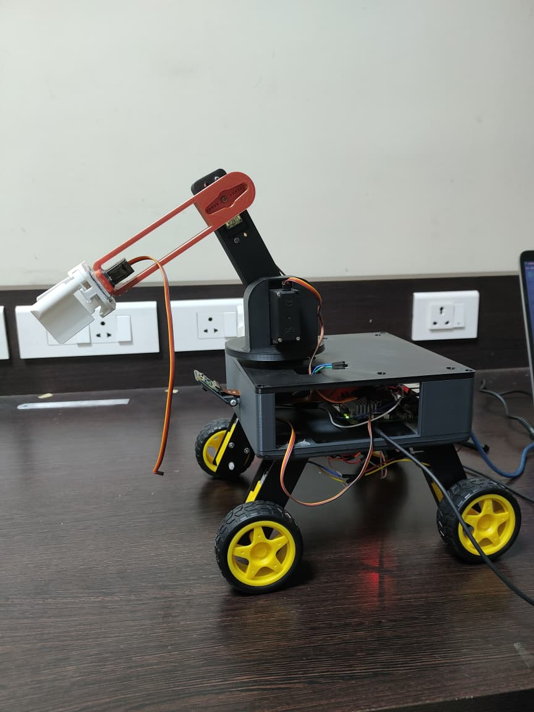
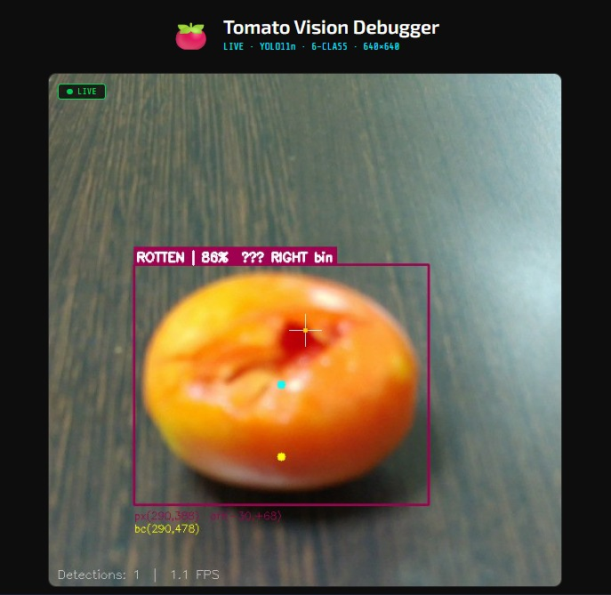
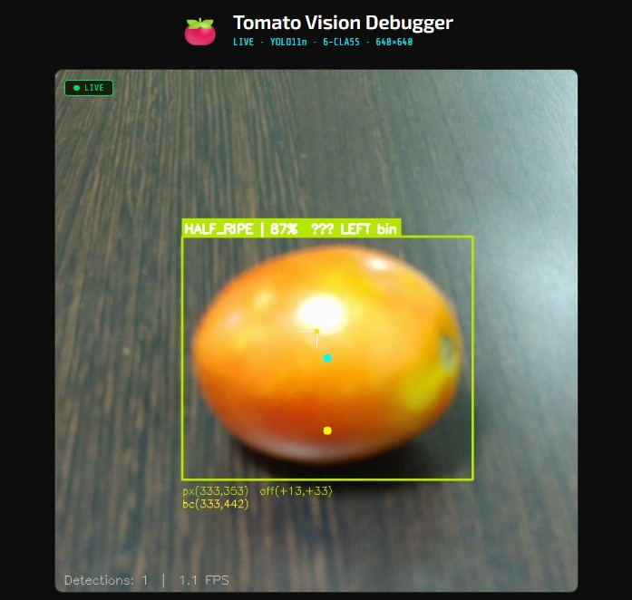
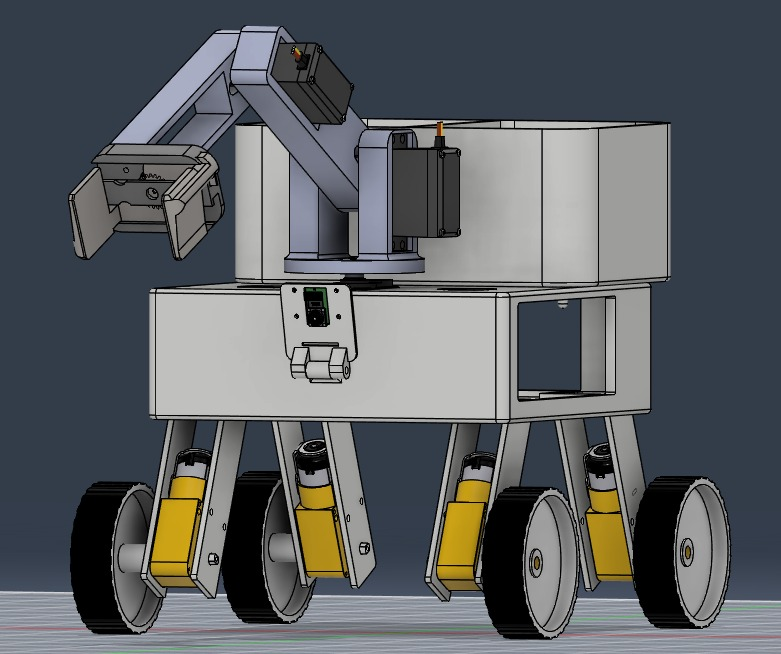
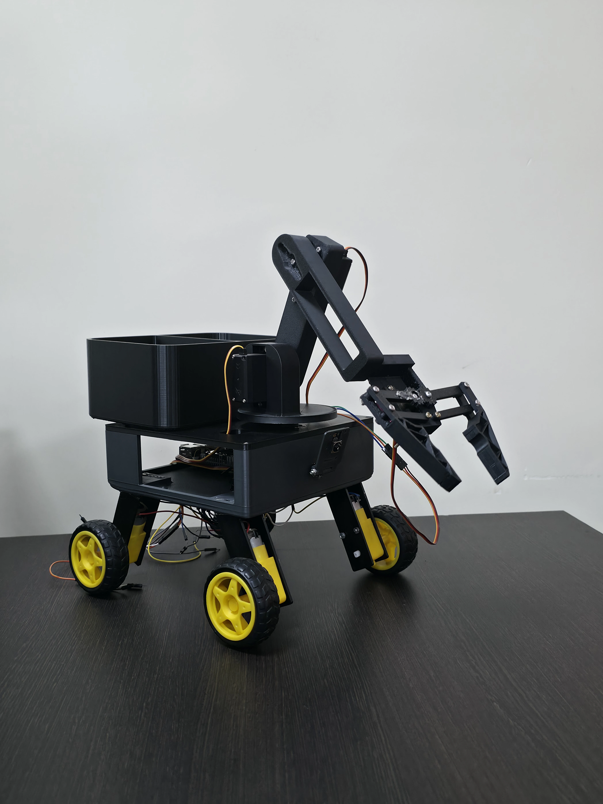

# Vision-Guided Fallen Fruit Collection Robot for Orchard Health Monitoring

<p align="center">
  
  &nbsp;&nbsp;
  
</p>

<p align="center">
  <b> B.Tech in Robotics & Artificial Intelligence</b><br>
  Department of Robotics & AI, NMAM Institute of Technology, Nitte<br>
  <i>May 2026</i>
</p>

---

##  Overview

This project presents an intelligent semi-autonomous robot designed to detect, collect, classify, and sort fallen tomatoes in orchard environments — without human intervention. It integrates **computer vision**, **deep learning (YOLO11n)**, and **geometric inverse kinematics** on edge hardware to reduce fruit waste and provide real-time orchard health insights.

The robot:
- **Detects** fallen tomatoes using a Raspberry Pi Camera Module 3
- **Classifies** each fruit into one of 6 health categories via a custom-trained YOLO11n Nano model (mAP@0.5 = **89.1%**)
- **Localizes** the fruit using a homography matrix (pixel → real-world mm coordinates)
- **Picks** it using a 3-DOF robotic arm with a parallel-jaw gripper
- **Sorts** it into an Edible bin (ripe/half-ripe) or a Reject bin (diseased/overripe/rot/unripe)

---

##  Demo & Model Weights

> 📦 Full demo videos, dataset, and model weights are hosted on HuggingFace:
>
> **[🤗 huggingface.co/kaushikurwa](https://huggingface.co/kaushikurwa)**

---

## System Architecture

```
Pi Camera Module 3
        │
        ▼
  YOLO11n Inference  ──►  Tomato Detected?
  (Raspberry Pi 5)              │ Yes
        │                       ▼
        │            Homography Matrix
        │           (Pixel → X_mm, Y_mm)
        │                       │
        │                       ▼
        │            Inverse Kinematics
        │         (θ_base, θ_shoulder, θ_elbow)
        │                       │
        │                       ▼
        └──────────►  Arduino Uno (Serial)
                              │
                              ▼
                    15-Step Pick Sequence
                    (1°/step, DONE handshake)
                              │
                    ┌─────────┴─────────┐
                    ▼                   ▼
               LEFT BIN            RIGHT BIN
           (ripe, half_ripe)   (overripe, rot,
                                diseased, unripe)
```

---

## AI Model Progression

| Model | Task | Accuracy / mAP |
|-------|------|----------------|
| MobileNetV2 | Classification (4 classes) | 95% |
| ResNet50 | Classification (Fresh/Rotten) | 92% |
| **YOLO11n** ✅ | **Object Detection (6 classes)** | **mAP@0.5 = 89.1%** |

YOLO11n was chosen for its real-time localization capability, critical for deriving coordinates to drive the robotic arm.

### 6 Fruit Health Categories
`diseased` · `half_ripe` · `overripe` · `ripe` · `rotten` · `unripe`

---

## Live Diagnostic Interface

<table align="center" width="90%">
  <tr>
    <td align="center" width="50%">
      
    </td>
    <td align="center" width="50%">
      
    </td>
  </tr>
  <tr>
    <td align="center"><sub>ROTTEN | 86% → RIGHT bin</sub></td>
    <td align="center"><sub>HALF_RIPE | 87% → LEFT bin</sub></td>
  </tr>
</table>

A Flask-based web interface streams real-time YOLO11n detections with bounding boxes, confidence scores, pixel-to-mm coordinates, and bin assignment, accessible from any browser on the same network.
---

## Hardware Stack

| Component | Specification | Role |
|-----------|--------------|------|
| Main Processor | Raspberry Pi 5 (8GB) | Vision inference + kinematics |
| Microcontroller | Arduino Uno | Motor actuation + handshake |
| Vision Sensor | Pi Camera Module 3 | Image capture |
| Arm Actuators | MG995 & MG90S Servos | 3-DOF arm + gripper |
| Locomotion | 300 RPM BO Motors × 4 | Chassis movement |
| Motor Driver | TB6612FNG | DC motor control |
| Power Regulation | LM2596 Buck Converter | Voltage regulation for servos |

**Total Build Cost: ₹14,334 (~$170 USD)**

---

## Software Stack

| Layer | Technology |
|-------|-----------|
| OS | Ubuntu (Linux) on Raspberry Pi 5 |
| Deep Learning | YOLO11n (Ultralytics) |
| Vision Processing | OpenCV (Homography calibration) |
| High-Level Logic | Python (`auto_picker.py`, `live_vision.py`) |
| Low-Level Control | C++ / Arduino Sketch (`master_listener.ino`) |
| Diagnostics | Flask web server |
| Remote Access | SSH |
| Simulation | Gazebo + RViz (URDF / TF tree) |

---

## Kinematic Model (3-DOF Arm)

**Step 1 — Base Rotation:**
```
θ_base = arctan2(X_mm, Y_mm)
```

**Step 2 — Reach Distance:**
```
Reach = √(X_mm² + Y_mm²)
```

**Step 3 — Elbow Angle (Law of Cosines):**
```
θ_elbow = arccos((D² - L1² - L2²) / (2 × L1 × L2))
```

**Step 4 — Shoulder Angle:**
```
θ_shoulder = arctan2(vertical, Reach) - α
α = arctan2(L2 × sin(θ_elbow), L1 + L2 × cos(θ_elbow))
```

---

## Repository Structure

```
├── src/                    
│   ├── my_robot_bringup
│   └── urdf_description
├── photo_vid/              # Project photos and demo videos
├── orchard_map.pgm         # ROS occupancy map
├── orchard_map.yaml        # Map metadata
└── README.md
```

---

---

## CAD Design

<p align="center">
  
  &nbsp;&nbsp;&nbsp;
  
</p>

The full assembly was designed in **Autodesk Fusion 360**, comprising the 4-wheel drive chassis, electronics enclosure, dual-compartment sorting bin, 3-DOF arm links, and parallel-jaw gripper. Each component was parametrically modelled and assembled with joint constraints before fabrication.

---

## Fabrication & Iteration

<p align="center">
  
  &nbsp;&nbsp;
  
</p>

The first fabricated prototype (left) validated the chassis geometry and arm reach. During initial pick trials, the **end effector servo (MG90S) failed under the load of a tomato**, stripping the gear train. The gripper assembly was redesigned with reinforced mounts and a revised finger geometry, resulting in the final build (right) which completed all pick-and-sort trials successfully.

---

## ROS2 Gazebo Simulation

A full simulation environment was built in **Gazebo (Classic)** with a URDF robot model, differential drive plugin, simulated LiDAR, and a downward-facing camera. The simulation validates the vision and navigation pipeline before deployment on hardware.

### Simulation Stack
| Tool | Role |
|------|------|
| Gazebo Classic | Physics simulation + sensor emulation |
| RViz2 | Robot model visualization + map display |
| slam_toolbox | Online SLAM map generation |
| rqt_image_view | Camera feed inspection |
| ros_gz_bridge | Gazebo ↔ ROS2 topic bridging |

---

### Robot Model & LiDAR Scan

<p align="center">
  
</p>

The robot was spawned in a custom orchard world with cylindrical tree obstacles and a tomato sphere. The blue LiDAR fan indicates that the 2D laser scan is actively sweeping the environment.

---

### Tomato Detection in Simulation

<p align="center">
  
  &nbsp;&nbsp;
  
</p>

The `tomato_vision_node` processes the `/camera/image_raw` topic using HSV masking and circularity filtering. When a tomato is detected (radius ≥ 45px), the `tomato_control_node` publishes velocity commands to `/cmd_vel`, steering the robot toward the target until the area threshold is met (≥ 6000px²) and the robot comes to a stop.

---

### SLAM Map Building

<p align="center">
  
  &nbsp;&nbsp;
  
  &nbsp;&nbsp;
  
</p>

**slam_toolbox** (online asynchronous mode) builds an occupancy grid in real time from the simulated LiDAR. The red laser scan overlay and the TF tree confirm all coordinate frames (`odom → base_footprint → laser`) are correctly bridged between Gazebo and ROS2.

---

### Terminal Output

<p align="center">
  
</p>

Four terminal panes show the full system running simultaneously: the `ros_gz_bridge`, `tomato_vision_node` reporting centroids and radii, `tomato_control_node` logging STOPPED events when the area threshold is reached, and `slam_toolbox` initializing with CeresSolver.
---

## Project Poster - EXPRO 2025–26

<p align="center">
  
</p>

Presented at **EXPRO 2025–26**, the annual project exposition at NMAM Institute of Technology, Nitte.

---
## Results Summary

- **YOLO11n mAP@0.5:** 0.891 across 6 classes
- **Best class AP:** Overripe → 0.947 | Ripe → 0.915
- **Confusion matrix highlights:** 89% Ripe, 87% Overripe, 85% Diseased correctly classified
- **Turnitin Similarity:** 9% (with bibliography filtered)
- **Pick routine:** 15-step sequence with degree-by-degree actuation and DONE handshake

---

## Future Work

1. Full autonomous navigation using **Monocular Visual SLAM**
2. **3D imaging / NIR sensors** for depth-aware detection
3. Real-time **orchard health mapping** from fruit coordinate logs
4. **Self-docking recharge station** for extended uptime
5. **Mesh networking** for multi-robot coordination
6. **Software camera stabilization** to handle uneven terrain vibrations

---

## License

This project was submitted in partial fulfillment of the requirements for the award of **B.Tech in Robotics & Artificial Intelligence** at NMAM Institute of Technology, Nitte (Deemed to be University), May 2026.

---

<p align="center">
  Made by Team NNM22RI NMAMIT, Nitte
</p>
